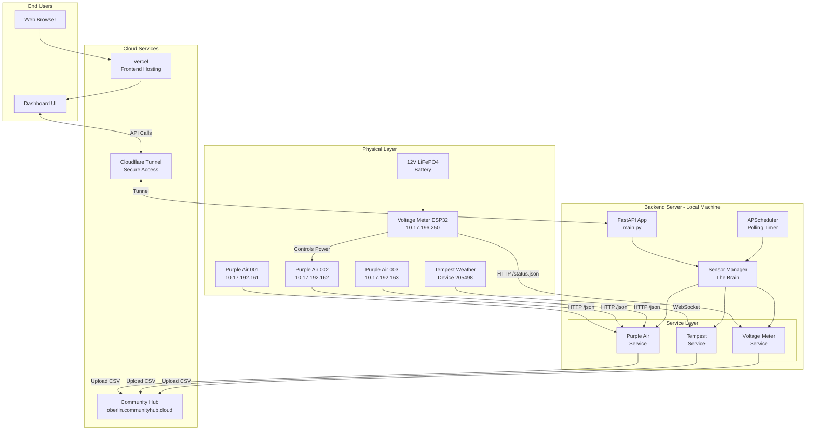
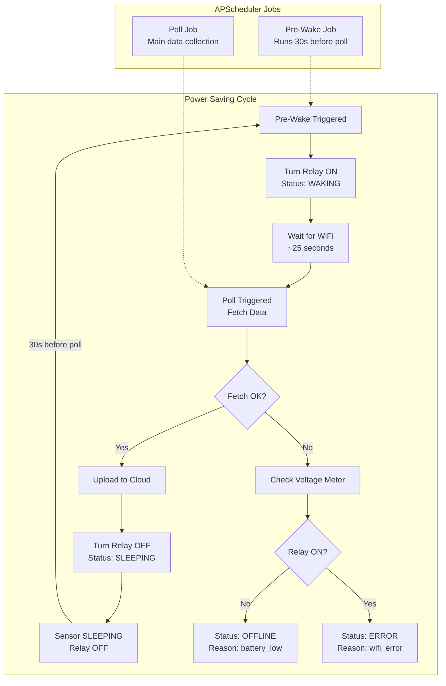
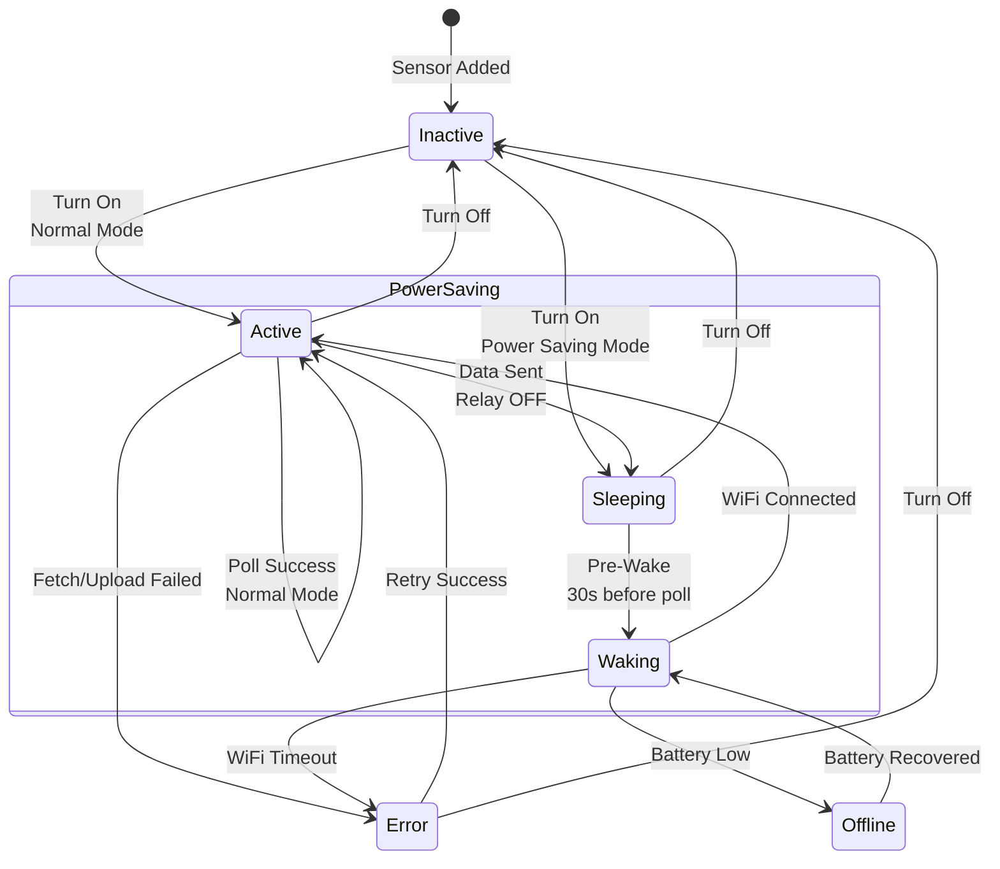
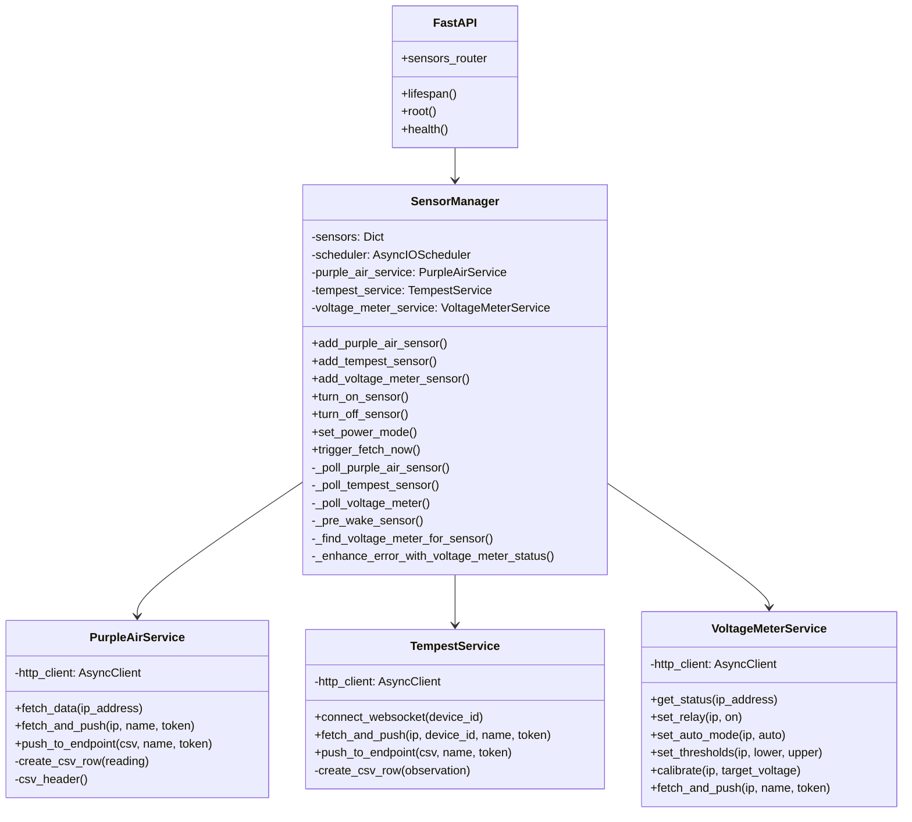
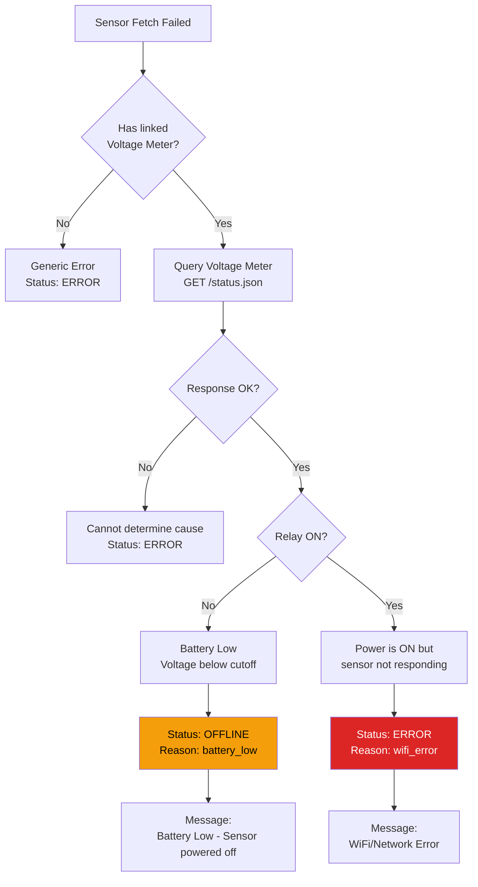
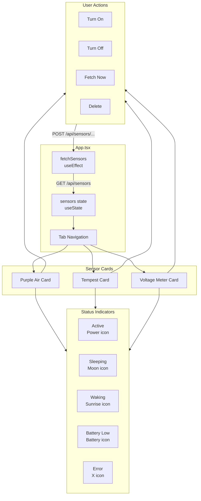

# Sensor Data Collector - System Architecture

A comprehensive overview of the system architecture with visual diagrams.

---

## 🌐 System Overview

How all components connect together - from physical sensors to the cloud.



---

## 🔋 Power Saving Mode Flow

How the system conserves battery by cycling power to sensors.



---

## 📊 Status State Machine

All possible sensor states and their transitions.



---

## 🔄 Data Flow Sequence

The journey of data from sensor to cloud.

```mermaid
sequenceDiagram
    autonumber
    
    participant SCH as Scheduler
    participant SM as SensorManager
    participant VMS as VoltageMeterService
    participant VM as Voltage Meter ESP32
    participant PAS as PurpleAirService
    participant PA as Purple Air Sensor
    participant CH as Community Hub
    
    Note over SCH,CH: Power Saving Mode - Full Cycle
    
    rect rgb(50, 50, 80)
        Note right of SCH: Pre-Wake Phase
        SCH->>SM: Pre-wake trigger (30s early)
        SM->>VMS: set_relay(ON)
        VMS->>VM: GET /relay?on=1
        VM-->>VMS: OK
        SM->>SM: status = WAKING
    end
    
    Note over PA: Sensor boots...<br/>~25 seconds
    
    rect rgb(50, 80, 50)
        Note right of SCH: Data Collection Phase
        SCH->>SM: Poll trigger
        SM->>PAS: fetch_and_push()
        PAS->>PA: GET /json
        PA-->>PAS: JSON sensor data
        PAS->>PAS: Convert to CSV
        PAS->>CH: POST /api/data-hub/upload/csv
        CH-->>PAS: 200 OK
        PAS-->>SM: Success + reading
    end
    
    rect rgb(80, 50, 50)
        Note right of SCH: Power Down Phase
        SM->>VMS: set_relay(OFF)
        VMS->>VM: GET /relay?on=0
        VM-->>VMS: OK
        SM->>SM: status = SLEEPING
    end
```



---

## 🏗️ Backend Components

Class diagram showing the backend service architecture.



---

## 🔍 Smart Error Detection

How the system determines the cause of sensor failures.



---

## 📡 ESP32 Voltage Meter API

The endpoints available on the Battery Cutoff Monitor.

```mermaid
flowchart LR
    subgraph ESP32 [ESP32 Voltage Meter]
        direction TB
        STATUS[/status.json<br/>GET]
        RELAY[/relay<br/>GET]
        SETTINGS[/settings<br/>GET]
    end
    
    subgraph StatusResponse [Status Response]
        V[voltage_v: 12.5]
        L[load_on: true]
        A[auto_mode: true]
        C[v_cutoff: 11.0]
        R[v_reconnect: 12.9]
    end
    
    subgraph RelayParams [Relay Parameters]
        ON[on=1 Turn ON]
        OFF[on=0 Turn OFF]
        AUTO[auto=1 Auto Mode]
    end
    
    subgraph SettingsParams [Settings Parameters]
        LOWER[lower=11.0 Cutoff]
        UPPER[upper=12.9 Reconnect]
        TARGET[target=13.5 Calibrate]
    end
    
    STATUS --> StatusResponse
    RELAY --> RelayParams
    SETTINGS --> SettingsParams
```

---

## 🖥️ Frontend Component Flow

How the React frontend displays sensor data.



---

## 📁 Project Structure

```
sensor_data_collector/
├── backend/
│   ├── app/
│   │   ├── main.py                 # FastAPI entry point
│   │   ├── models/
│   │   │   └── sensor.py           # Pydantic models
│   │   ├── routers/
│   │   │   └── sensors.py          # API endpoints
│   │   └── services/
│   │       ├── sensor_manager.py   # The Brain
│   │       ├── purple_air_service.py
│   │       ├── tempest_service.py
│   │       └── voltage_meter_service.py
│   ├── sensors_db.json             # Persistent storage
│   └── requirements.txt
│
├── frontend/
│   ├── src/
│   │   ├── App.tsx                 # Main component
│   │   ├── api.ts                  # API client
│   │   ├── types.ts                # TypeScript types
│   │   └── index.css               # Styles
│   └── package.json
│
├── docs/
│   └── ARCHITECTURE.md             # Detailed docs
│
├── ARCHITECTURES.md                # This file!
└── README.md
```

---

## 🔑 Key Concepts

| Concept | Description |
|---------|-------------|
| **Power Saving Mode** | Cycles relay to conserve battery - sensor sleeps between polls |
| **Pre-Wake** | Turns relay ON 30 seconds early so sensor can boot and connect WiFi |
| **Smart Error Detection** | Checks voltage meter to distinguish battery_low vs wifi_error |
| **Status Reason** | Additional context for why sensor is in current state |
| **Linked Sensor** | Voltage Meter can be linked to a Purple Air sensor to control its power |

---

## 📈 Timing Diagram

```mermaid
gantt
    title Power Saving Mode Timing
    dateFormat ss
    axisFormat %S

    section Relay
    OFF (Sleeping)     :done, sleep1, 00, 30s
    ON (Waking)        :active, wake, after sleep1, 30s
    OFF (Sleeping)     :done, sleep2, after wake, 30s

    section Sensor
    Powered Off        :done, off1, 00, 30s
    Booting            :crit, boot, after off1, 25s
    Connected          :active, conn, after boot, 5s
    Powered Off        :done, off2, after conn, 30s

    section Data
    Waiting            :done, wait, 00, 55s
    Fetch + Upload     :active, fetch, after wait, 5s
    Waiting            :done, wait2, after fetch, 30s
```



---

*Generated for Sensor Data Collector - Environmental Dashboard*
