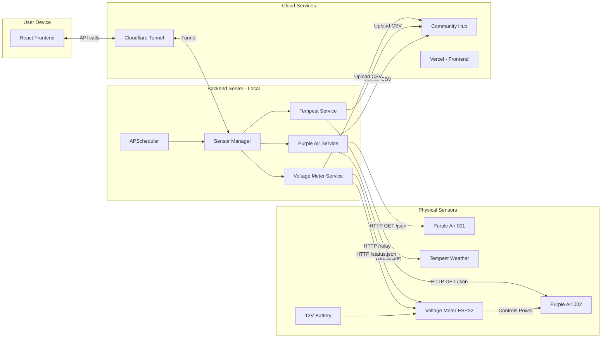
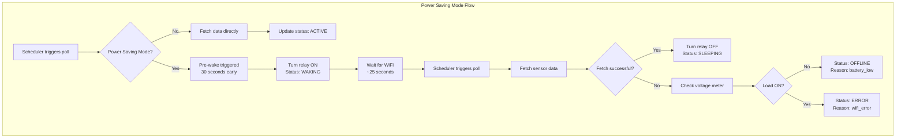
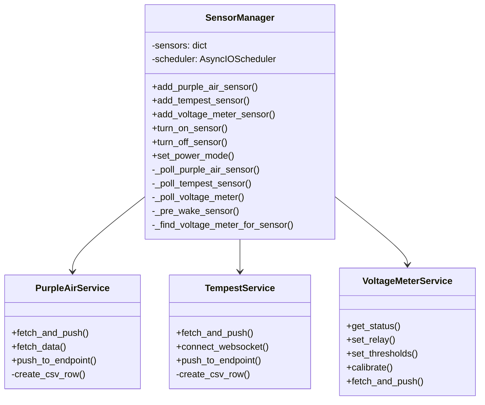
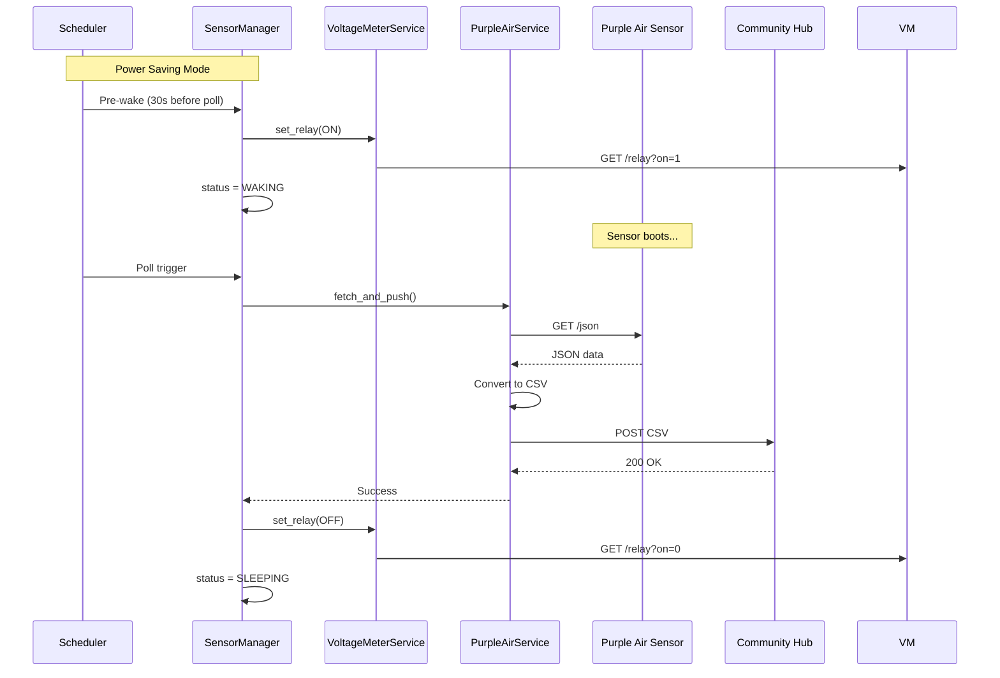
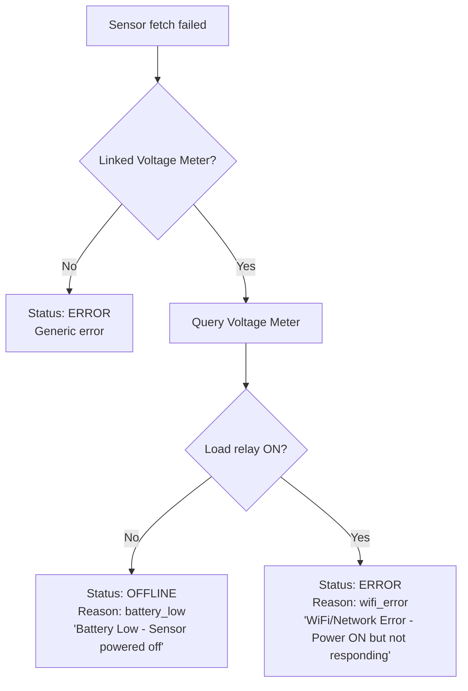

# Sensor Data Collector - Architecture

## Overview

The Sensor Data Collector is a system for collecting data from environmental sensors and uploading it to a cloud platform (Community Hub). It supports multiple sensor types and includes power management features for battery-powered deployments.

## System Architecture



## Power Saving Mode

For battery-powered Purple Air sensors, the system can cycle power to conserve battery life.

### Flow Diagram



### Timing

- Poll interval: 60 seconds (configurable)
- Pre-wake time: 30 seconds before poll
- Sensor boot time: ~25 seconds
- WiFi connection: ~5 seconds after boot

### Status States

| Status | Description | Icon |
|--------|-------------|------|
| `active` | Sensor is powered and sending data | Power |
| `inactive` | Polling disabled by user | PowerOff |
| `sleeping` | Power saving: Relay OFF, waiting for next poll | Moon |
| `waking` | Power saving: Relay ON, sensor booting | Sunrise |
| `offline` | Cannot reach sensor (battery_low or network issue) | Battery/WifiOff |
| `error` | Error during data fetch or upload | XCircle |

## Component Details

### Backend Services



### Data Flow



## API Endpoints

### Sensor Management

| Method | Endpoint | Description |
|--------|----------|-------------|
| GET | `/api/sensors/` | List all sensors |
| GET | `/api/sensors/{id}` | Get sensor details |
| DELETE | `/api/sensors/{id}` | Delete sensor |
| POST | `/api/sensors/{id}/turn-on` | Start polling |
| POST | `/api/sensors/{id}/turn-off` | Stop polling |
| POST | `/api/sensors/{id}/fetch-now` | Trigger immediate fetch |
| POST | `/api/sensors/{id}/power-mode` | Set power mode |

### Sensor Types

| Method | Endpoint | Description |
|--------|----------|-------------|
| POST | `/api/sensors/purple-air` | Add Purple Air sensor |
| GET | `/api/sensors/purple-air` | List Purple Air sensors |
| POST | `/api/sensors/tempest` | Add Tempest sensor |
| GET | `/api/sensors/tempest` | List Tempest sensors |
| POST | `/api/sensors/voltage-meter` | Add Voltage Meter |
| GET | `/api/sensors/voltage-meter` | List Voltage Meters |

## ESP32 Voltage Meter API

The Voltage Meter is an ESP32-based device that monitors battery voltage and controls a relay.

### Endpoints

| Method | Endpoint | Description |
|--------|----------|-------------|
| GET | `/status.json` | Get current status |
| GET | `/relay?on=1` | Turn relay ON |
| GET | `/relay?on=0` | Turn relay OFF |
| GET | `/relay?auto=1` | Enable auto mode |
| GET | `/settings?lower=X&upper=Y` | Set thresholds |
| GET | `/settings?target=X` | Auto-calibrate ADC |

### Status Response

```json
{
  "voltage_v": 12.5,
  "load_on": true,
  "auto_mode": true,
  "v_cutoff": 11.0,
  "v_reconnect": 12.9,
  "calibration_factor": 1.17,
  "cycle_count": 42,
  "turn_on_count_48h": 5,
  "uptime_ms": 123456
}
```

## Smart Error Detection

When a sensor cannot be reached, the system checks the Voltage Meter to determine the cause:



## File Structure

```
sensor_data_collector/
├── backend/
│   ├── app/
│   │   ├── main.py              # FastAPI app entry point
│   │   ├── models/
│   │   │   ├── __init__.py
│   │   │   └── sensor.py        # Pydantic models
│   │   ├── routers/
│   │   │   ├── __init__.py
│   │   │   └── sensors.py       # API endpoints
│   │   └── services/
│   │       ├── __init__.py
│   │       ├── purple_air_service.py
│   │       ├── tempest_service.py
│   │       ├── voltage_meter_service.py
│   │       └── sensor_manager.py
│   ├── sensors_db.json          # Persistent sensor storage
│   └── requirements.txt
├── frontend/
│   ├── src/
│   │   ├── App.tsx              # Main React component
│   │   ├── api.ts               # API client
│   │   ├── types.ts             # TypeScript types
│   │   └── index.css            # Styles
│   └── package.json
└── docs/
    └── ARCHITECTURE.md          # This file
```

## Environment Variables

### Backend

| Variable | Description | Default |
|----------|-------------|---------|
| `POLLING_INTERVAL` | Seconds between polls | 60 |
| `TEMPEST_API_TOKEN` | WeatherFlow API token | - |

### Frontend

| Variable | Description | Default |
|----------|-------------|---------|
| `VITE_API_URL` | Backend API URL | http://localhost:8000 |

## Deployment

### Local Development

1. Start the backend:
   ```bash
   cd backend
   pip install -r requirements.txt
   uvicorn app.main:app --reload
   ```

2. Start the frontend:
   ```bash
   cd frontend
   npm install
   npm run dev
   ```

### Production

1. Backend runs on a local machine with network access to sensors
2. Cloudflare Tunnel exposes the backend API
3. Frontend is deployed to Vercel
4. `VITE_API_URL` points to the Cloudflare Tunnel URL

## License

MIT License - See LICENSE file for details.
